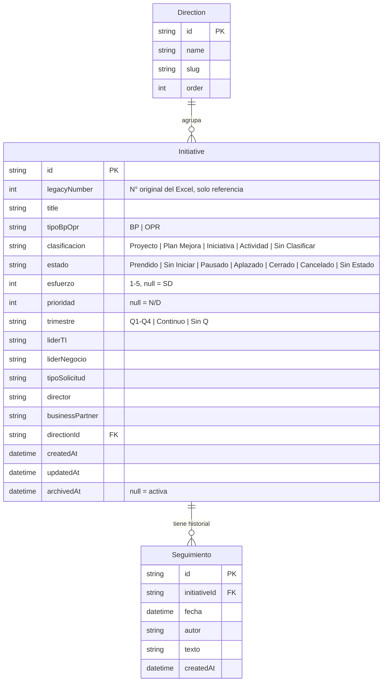

# Diseño de Solución — Aplicación de Seguimiento de Planeación Estratégica SEGTI 2026

**Rol:** Coordinación de Proyectos (PMP / Ágil) + Diseño Web
**Fecha:** agosto de 2026
**Estado:** MVP (Fase 1) implementado en esta misma carpeta. Este documento es el diseño completo de la solución, incluyendo lo ya construido y el roadmap de lo que falta.

---

## 1. Descripción general y valor de negocio

El archivo `Planeacion_Estrategica_2026_SEGTI_v2JMG.xlsx` gestiona hoy, a mano, un portafolio de **~145 iniciativas estratégicas** repartidas en **12 Direcciones/Subdirecciones**. La inspección directa del archivo (15 hojas, 1.440+ fórmulas, cero validaciones de datos) reveló cuatro problemas estructurales que cualquier rediseño debe resolver de raíz:

1. **Sincronización frágil basada en texto.** La hoja maestra "Cronograma Priorización" trae 5 de sus 16 columnas desde las hojas de dirección mediante `XLOOKUP` contra una "llave de sincronización" que es una copia de texto libre del título — no un identificador estable. Esa sincronización ya está **rota en producción** para toda la Dirección de Tecnología, que no tiene columna de llave.
2. **Historial de seguimientos sin estructura.** Cada hoja de dirección fue acumulando columnas ad hoc (`seguimiento 10062026`, `SEGUIMIENTO 16062026`, `seguimiento 160626`, columnas sin encabezado…) con formatos de fecha inconsistentes. No hay una sola fuente de verdad del historial de una iniciativa.
3. **Sin catálogos controlados.** Estado, Clasificación, Tipo de Solicitud, Prioridad y Esfuerzo son texto/número libre. Existen `Cerrado`, `cerrado` y `CERRADO` como tres valores distintos para el mismo estado.
4. **Dashboards que se desactualizan solos.** De los 4 bloques del "Análisis General", solo los totales tienen fórmula; los desgloses por dirección, trimestre y clasificación son **constantes tipeadas a mano** que quedan obsoletas cada vez que cambian los datos base.

**Valor de negocio de la nueva aplicación:**

- **Una sola fuente de verdad por iniciativa**, con identificador estable y sin dependencia de texto libre para relacionar datos.
- **Dashboards siempre correctos**, porque todos los agregados (por dirección, trimestre, estado, clasificación, tipo de solicitud, líder TI) se calculan en vivo desde los datos, nunca se guardan como snapshot.
- **Historial de seguimiento real**, consultable por fecha, en vez de columnas dispersas con formatos distintos por hoja.
- **Visibilidad proactiva de riesgo** (iniciativas sin avance, cerca de fin de trimestre, pausadas mucho tiempo) sin que un Coordinador tenga que revisar 145 filas a mano.
- **Menor fricción para Directores y Business Partners**: vistas ya filtradas por su Dirección, en vez de tener que ubicar su pestaña en un Excel de 15 hojas.

---

## 2. Módulos principales

| Módulo | Incluido en MVP (Fase 1) | Fase futura |
|---|---|---|
| Gestión de Iniciativas (alta, edición, archivado, clonado) | ✅ | — |
| Vistas y Filtros (Cronograma, por Dirección) | ✅ | Vista Gantt/timeline por trimestre (Fase 2) |
| Dashboard Ejecutivo (Análisis General) | ✅ | — |
| Seguimientos Históricos | ✅ | — |
| Alertas y Riesgos (calculadas, mostradas en la app) | ✅ | Notificaciones por correo real (Fase 2) |
| Importador desde Excel | ✅ (carga inicial real) | Sincronización incremental / recurrente (Fase 4) |
| Reportes y Exportación | ✅ Excel | PDF (Fase 2) |
| Roles y Permisos | ✅ selector de rol sin login | Login real + multiusuario (Fase 3) |
| Administración de Catálogos (Direcciones, Estados, Tipos) | Catálogos fijos, editables solo en código | UI de administración (Fase 3) |
| Estadística de Innovación (compromisos especiales) | ⛔ fuera de alcance | Fase 2 |

---

## 3. Modelo de datos recomendado



**Por qué este modelo resuelve los problemas del Excel:**

- **`Initiative.id`** es un identificador generado por el sistema (cuid), no depende de texto libre. `legacyNumber` se conserva solo como referencia visual al N° original.
- **`Seguimiento`** es una tabla propia (uno-a-muchos), no columnas. Se puede tener cualquier cantidad de seguimientos por iniciativa, ordenados por fecha, sin importar cuántos "eventos" haya tenido.
- **Los catálogos** (`estado`, `clasificacion`, `tipoSolicitud`, `trimestre`, `tipoBpOpr`) se normalizan a un conjunto fijo de valores en la capa de aplicación (`src/lib/types.ts`), en vez de aceptar cualquier texto. *Nota técnica:* SQLite (motor usado en el MVP local) no soporta `enum` nativos en Prisma, así que estos campos se guardan como `String` en la base de datos pero se tipan y validan como uniones literales de TypeScript en toda la aplicación — el mismo efecto de un catálogo controlado, sin depender de una característica del motor de base de datos que limitaría la portabilidad.
- **Las alertas no se guardan** — se calculan en cada consulta a partir de `Initiative` + `Seguimiento` (ver sección 7), así que nunca quedan desactualizadas como los contadores manuales del Excel actual.
- El campo **`businessPartner`** existe en el modelo pero las hojas de dirección de origen no lo traían (solo vive en el Cronograma maestro, fuera del alcance del importador). Queda disponible para completarse manualmente desde la app.

---

## 4. Flujos de usuario clave

**Alta de iniciativa**
1. Un Director/Coordinador entra a "+ Nueva iniciativa" desde cualquier pantalla.
2. Completa nombre, Dirección, clasificación, estado inicial, trimestre, líderes y tipo de solicitud.
3. Al guardar, la iniciativa aparece de inmediato en el Cronograma y en la vista de su Dirección — no hace falta ninguna sincronización manual.

**Registro de seguimiento**
1. Desde la ficha de una iniciativa, el usuario con permiso (todos salvo "Solo lectura") escribe un avance con fecha y texto.
2. El seguimiento se agrega al timeline de la iniciativa, ordenado por fecha.
3. La fecha de "última actualización" que usan las alertas se recalcula automáticamente.

**Generación de alertas**
1. Cada vez que se abre el tablero de "Riesgos y Alertas", la aplicación recorre todas las iniciativas activas y aplica las 5 reglas de la sección 7.
2. No hay paso manual: no existe un botón "recalcular", las alertas siempre reflejan el estado actual de la base de datos.
3. El usuario hace clic en una alerta y llega directo a la ficha de la iniciativa para actuar.

**Consulta por Dirección**
1. Un Director selecciona su Dirección en el menú lateral.
2. Ve sus KPIs (total, iniciativas por estado, % activo) y su lista filtrable, sin ver las 144 iniciativas de las demás direcciones.
3. Puede aplicar filtros adicionales (trimestre, estado, clasificación) igual que en el Cronograma general.

---

## 5. Dashboard y tipos de gráficas

| Gráfica | Tipo | En MVP |
|---|---|---|
| KPIs (Total, Prendidas, Sin Iniciar, Pausadas/Aplazadas, Cerradas, Canceladas) | Tarjetas numéricas | ✅ |
| Iniciativas por Dirección, desglosadas por Estado | Barras apiladas | ✅ |
| Iniciativas por Trimestre | Barras | ✅ |
| Iniciativas por Clasificación | Barras | ✅ |
| Iniciativas por Tipo de Solicitud | Barras | ✅ |
| Carga por Líder TI (top 10) | Barras horizontales | ✅ |
| Matriz Prioridad × Esfuerzo | Heatmap (mapa de calor) | ✅ |
| Tendencia de seguimientos en el tiempo | Línea | Fase 2 (requiere volumen histórico acumulado) |
| Timeline/Gantt por trimestre | Gantt simplificado | Fase 2 |

Todas las gráficas del MVP se calculan **en cada carga de página**, directamente desde la base de datos — no hay ningún número pre-calculado que se pueda desincronizar, a diferencia del Excel actual.

Los colores siguen una paleta validada para accesibilidad (contraste y distinción bajo daltonismo): los estados usan una paleta de "semáforo" fija (verde=Prendido, ámbar=Sin Iniciar, naranja=Pausado/Aplazado, rojo=Cancelado, gris=Cerrado/Sin Estado) y las demás gráficas usan un único color de serie, ya que la distinción de categorías la da el eje, no el color.

---

## 6. Organización de la información para agilidad de seguimiento

Navegación de la barra lateral (siempre visible):

```
Cronograma            ← tabla global, filtrable/ordenable, equivalente a la hoja maestra
Análisis General       ← dashboard ejecutivo
Riesgos y Alertas       ← lo que necesita atención hoy
── Por Dirección ──
  Dirección Médica
  Dirección de Enfermería
  ...(12 direcciones)
+ Nueva iniciativa
Exportar a Excel
[Selector de rol activo]
```

Esto reemplaza la necesidad de "encontrar la pestaña correcta" en un libro de 15 hojas: cada Dirección tiene su propia URL fija (`/direccion/dir-medica`, etc.), compartible y con sus propios KPIs.

La **ficha de iniciativa** (`/iniciativas/[id]`) centraliza todo lo que hoy está disperso: los campos editables arriba, y el timeline completo de seguimientos abajo — con formulario para agregar uno nuevo. Esto resuelve directamente el problema de columnas de seguimiento dispersas e inconsistentes del Excel.

---

## 7. Lógica de alertas recomendada

Implementada en `src/lib/alerts.ts`, sin estado persistido — se deriva en cada consulta:

| Regla | Condición (umbral por defecto) | Severidad |
|---|---|---|
| **Sin Iniciar prioritaria** | Estado = Sin Iniciar **y** (Prioridad ≤ 2 **o** Esfuerzo ≥ 4) | Alta |
| **Prendida sin seguimiento** | Estado = Prendido **y** han pasado ≥ 15 días desde el último seguimiento (o desde su creación si no tiene ninguno) | Alta si ≥ 30 días, si no Media |
| **Fin de trimestre sin avance** | Faltan ≤ 10 días para el fin del trimestre declarado **y** no hay seguimiento en esos últimos 10 días **y** el estado no es Cerrado/Cancelado | Alta |
| **Pausada/Aplazada por mucho tiempo** | Estado = Pausado o Aplazado **y** ≥ 30 días sin resolución | Media |
| **Posible desviación de esfuerzo** | Estado = Prendido, Esfuerzo ≥ 4, **cero** seguimientos registrados y han pasado ≥ 30 días desde su creación | Media |

Todos los umbrales están centralizados en `ALERT_THRESHOLDS` (mismo archivo) para ajustarse sin tocar la lógica de cada regla.

**Evolución a Fase 2 (correo real):** el mismo motor de reglas (`getActiveAlerts`) puede ejecutarse en un job programado (cron) en vez de en cada carga de página, y enviar un resumen diario/semanal por correo (Resend/SES) a cada Director/BP con solo las alertas de sus iniciativas — sin cambiar la lógica de negocio, solo agregando el disparador y el canal de salida.

---

## 8. Stack tecnológico

| Componente | Elección | Por qué |
|---|---|---|
| Framework | **Next.js 14 (App Router) + TypeScript** | Un solo proceso sirve frontend y API — ideal para uso local, sin infraestructura adicional que mantener. |
| Base de datos | **SQLite vía Prisma ORM** | Cero configuración de servidor de base de datos; el archivo `.db` vive junto al proyecto. Prisma facilita migrar a Postgres cambiando solo el `datasource` cuando se pase a Fase 3 (multiusuario). |
| Gráficas | **Recharts** | Se integra de forma nativa con componentes React, suficiente para barras/heatmap/tendencias sin curva de aprendizaje alta. |
| Tablas | **TanStack Table** | Orden y filtrado del lado del cliente sin reinventar la lógica de paginación/orden. |
| Import/Export Excel | **SheetJS (`xlsx`)** | Misma librería para leer el Excel real de origen y para generar exportaciones — un solo formato de datos que aprender. |
| Estilos | **Tailwind CSS** | Velocidad de construcción de UI consistente sin diseñar un sistema de componentes desde cero para un MVP. |

**Camino de evolución a multiusuario (Fase 3):** Postgres administrado (Neon/Supabase/RDS) reemplazando SQLite (cambio de una línea en `schema.prisma` + migración de datos), NextAuth.js para login real con roles, y un servicio de correo transaccional (Resend/SES) para las notificaciones de la Fase 2.

---

## 9. Roles y permisos

| Rol | Crear | Editar | Archivar | Clonar | Agregar seguimiento | Administrar catálogos |
|---|:---:|:---:|:---:|:---:|:---:|:---:|
| Coordinador | ✅ | ✅ | ✅ | ✅ | ✅ | ✅ |
| Director | ✅ | ✅ | ✅ | ✅ | ✅ | ⛔ |
| Business Partner | ⛔ | ✅ | ⛔ | ⛔ | ✅ | ⛔ |
| Líder TI | ⛔ | ✅ | ⛔ | ⛔ | ✅ | ⛔ |
| Solo lectura | ⛔ | ⛔ | ⛔ | ⛔ | ⛔ | ⛔ |

**En el MVP** esto se implementa como un *selector de rol activo* (`src/components/RoleSwitcher.tsx`) sin autenticación real — controla qué botones/campos se habilitan en la interfaz, pensado para validar el modelo de permisos en un entorno de un solo usuario local. **En Fase 3**, la misma matriz de permisos (`src/lib/roles.ts`) se conecta a un usuario autenticado real vía NextAuth, y además se puede acotar por Dirección (que un Director solo pueda editar iniciativas de su propia Dirección).

---

## 10. Usabilidad e importación desde el Excel actual

El importador (`src/lib/importer/`) fue construido y probado contra el archivo real, no contra datos de ejemplo. Decisiones clave de diseño, motivadas por problemas reales encontrados en el archivo:

- **No confía en la "llave de sincronización" ni en el N° del Excel** como identificador — genera un ID propio por fila. El N° original se conserva solo como referencia visual.
- **Detecta la fila de encabezados dinámicamente** (buscando "N°" en la columna A) en vez de asumir que siempre está en la fila 8, porque el formato podría variar entre hojas.
- **Normaliza Estado/Clasificación/Tipo de Solicitud/Trimestre** de forma insensible a mayúsculas y acentos (`Cerrado` = `cerrado` = `CERRADO`), y cuando encuentra un valor no reconocido (p. ej. `pendiente`, que no está en la leyenda oficial de 4 estados) **no adivina**: lo deja en el valor neutro correspondiente (`Sin Estado`, `Sin Clasificar`, etc.) y lo reporta en un log de advertencias para revisión humana.
- **Detecta y descarta automáticamente las mini-tablas de resumen** ("RESUMEN POR CLASIFICACIÓN") que algunas hojas tienen al final, en vez de importarlas como si fueran iniciativas — se identifican porque no tienen un N° numérico válido.
- **Reconoce columnas de seguimiento por patrón, no por posición fija**, ya que cada hoja las nombra distinto (`seguimiento 10062026`, `SEGUIMIENTO 16062026`, `seguimiento 160626`, o incluso sin encabezado). Dentro de una celda, separa múltiples entradas por `|` y extrae la fecha de cada una (soporta `DD/MM/YYYY`, `DDMMYYYY` y `DDMMYY`); si no puede determinar una fecha exacta, usa una fecha aproximada y lo marca como advertencia.
- **Detecta (sin corregir automáticamente) texto de seguimiento mal ubicado** — el caso real encontrado en Dirección de Tecnología, donde el seguimiento quedó pegado en la columna "Director" — y lo señala para revisión manual en vez de moverlo por adivinanza.

**Resultado de la importación real:** 144 de ~145 iniciativas cargadas correctamente, con 108 advertencias registradas en `docs/import-warnings.txt` (la mayoría son las mini-tablas de resumen correctamente descartadas y fechas aproximadas de seguimiento, no errores de datos). Este reporte es el punto de partida para que un Coordinador revise y limpie los casos ambiguos antes de dar por buena la migración completa.

**Para reimportar** (por ejemplo tras corregir el Excel original): `npm run db:seed`. Para solo generar el reporte de advertencias sin tocar la base de datos: `npm run import:report`.

---

## 11. Roadmap por fases

**Fase 1 — MVP (esta entrega, ya implementada)**
Modelo de datos, importador del Excel real, CRUD de iniciativas, vistas (Cronograma / por Dirección / Análisis General), seguimientos históricos, alertas calculadas, selector de rol, exportación a Excel.

**Fase 2 — Cierre de brechas funcionales**
- Módulo de Estadística de Innovación (compromisos especiales) como su propia entidad relacionada a `Initiative`.
- Exportación a PDF de reportes por Dirección.
- Notificaciones por correo real (resumen semanal/mensual + alertas críticas), reutilizando el motor de `alerts.ts`.
- Vista Gantt/timeline simplificada por trimestre.
- Gráfica de tendencia de seguimientos en el tiempo.

**Fase 3 — Multiusuario real**
- Login real (NextAuth) con los mismos 5 roles, permisos acotados por Dirección.
- Migración de SQLite a Postgres administrado.
- Despliegue en la nube (Vercel/Azure/AWS).
- UI de administración de catálogos (agregar/editar Direcciones, valores de Tipo de Solicitud, etc.) sin tocar código.

**Fase 4 — Mejoras futuras**
- IA para predicción de retrasos, usando el historial de seguimientos como serie de entrenamiento (p. ej. detectar patrones de iniciativas que terminan pausadas/canceladas).
- Integración con herramientas existentes (Teams/Slack) para el envío de alertas en tiempo real.
- Importación incremental/recurrente desde Excel (en vez de la carga única actual), para equipos que durante la transición sigan alimentando el archivo original en paralelo.
